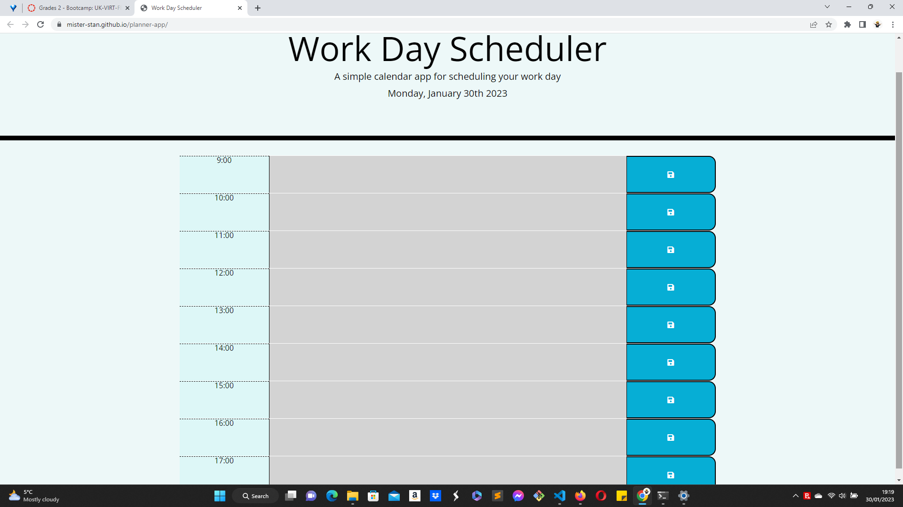

# planner app

## Website link: https://mister-stan.github.io/planner-app/

## 

## This is a website built using HTML, CSS and javaScript and represents a simple calendar application that allows a user to save events for each hour of the day . The app runs in the browser, features dynamically updated HTML and CSS powered by JavaScript, and has a clean, polished, responsive user interface. 
 

## Built with:HTML, CSS and javaScript

## Installation N/A

## Credits https://skillsforlife.edx.org/

## License MIT 
